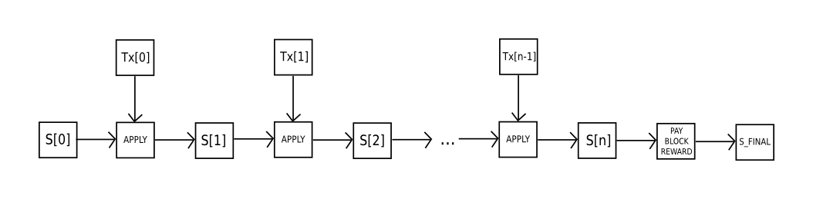

The intent of Ethereum is to create an alternative protocol for building decentralized
applications, providing a different set of tradeoffs that we believe will be very useful
for a large class of decentralized applications, with particular emphasis on situations
where rapid development time, security for small and rarely used applications,
and the ability of different applications to very efficiently interact, are important.
Ethereum does this by building what is essentially the ultimate abstract foundational layer: a blockchain with a built-in Turing-complete programming language, allowing anyone to write smart contracts and decentralized applications where they can create their own arbitrary rules for ownership, transaction formats and state transition functions. A bare-bones version of Namecoin can be written in two lines of code, and other protocols like currencies and reputation systems can be built in under twenty. Smart contracts, cryptographic "boxes" that contain value and only unlock it if certain conditions are met, can also be built on top of the platform, with vastly more power than that offered by Bitcoin scripting because of the added powers of Turing-completeness, value-awareness, blockchain-awareness and state.

## Philosophy

The design behind Ethereum is intended to follow the following principles:

1. **Simplicity**: the Ethereum protocol should be as simple as possible, even at the cost of some data storage or time inefficiency.[^3] An average programmer should ideally be able to follow and implement the entire specification,[^4] so as to fully realize the unprecedented democratizing potential that cryptocurrency brings and further the vision of Ethereum as a protocol that is open to all. Any optimization which adds complexity should not be included unless that optimization provides very substantial benefit.
2. **Universality**: a fundamental part of Ethereum's design philosophy is that Ethereum does not have "features".[^5] Instead, Ethereum provides an internal Turing-complete scripting language, which a programmer can use to construct any smart contract or transaction type that can be mathematically defined. Want to invent your own financial derivative? With Ethereum, you can. Want to make your own currency? Set it up as an Ethereum contract. Want to set up a full-scale Daemon or Skynet? You may need to have a few thousand interlocking contracts, and be sure to feed them generously, to do that, but nothing is stopping you with Ethereum at your fingertips.
3. **Modularity**: the parts of the Ethereum protocol should be designed to be as modular and separable as possible. Over the course of development, our goal is to create a program where if one was to make a small protocol modification in one place, the application stack would continue to function without any further modification. Innovations such as Ethash (see the [Yellow Paper Appendix](https://ethereum.github.io/yellowpaper/paper.pdf#appendix.J) or [wiki article](https://github.com/ethereum/wiki/wiki/Ethash)), modified Patricia trees ([Yellow Paper](https://ethereum.github.io/yellowpaper/paper.pdf#appendix.D), [wiki](https://github.com/ethereum/wiki/wiki/%5BEnglish%5D-Patricia-Tree)) and RLP ([YP](https://ethereum.github.io/yellowpaper/paper.pdf#appendix.B), [wiki](https://github.com/ethereum/wiki/wiki/%5BEnglish%5D-RLP)) should be, and are, implemented as separate, feature-complete libraries. This is so that even though they are used in Ethereum, even if Ethereum does not require certain features, such features are still usable in other protocols as well. Ethereum development should be maximally done so as to benefit the entire cryptocurrency ecosystem, not just itself.
4. **Agility**: details of the Ethereum protocol are not set in stone. Although we will be extremely judicious about making modifications to high-level constructs, for instance with the [sharding roadmap](https://ethresear.ch/t/sharding-phase-1-spec/1407/), abstracting execution, with only data availability enshrined in consensus. Computational tests later on in the development process may lead us to discover that certain modifications, e.g. to the protocol architecture or to the Ethereum Virtual Machine (EVM), will substantially improve scalability or security. If any such opportunities are found, we will exploit them.
5. **Non-discrimination** and **non-censorship**: the protocol should not attempt to actively restrict or prevent specific categories of usage. All regulatory mechanisms in the protocol should be designed to directly regulate the harm and not attempt to oppose specific undesirable applications. A programmer can even run an infinite loop script on top of Ethereum for as long as they are willing to keep paying the per-computational-step transaction fee.

## Ethereum Accounts

In Ethereum, the state is made up of objects called "accounts", with each account having a 20-byte address and state transitions being direct transfers of value and information between accounts. An Ethereum account contains four fields:

* The **nonce**, a counter used to make sure each transaction can only be processed once
* The account's current **ether balance**
* The account's **contract code**, if present
* The account's **storage** (empty by default)

"Ether" is the main internal crypto-fuel of Ethereum, and is used to pay transaction fees. In general, there are two types of accounts: **externally owned accounts**, controlled by private keys, and **contract accounts**, controlled by their contract code. An externally owned account has no code, and one can send messages from an externally owned account by creating and signing a transaction; in a contract account, every time the contract account receives a message its code activates, allowing it to read and write to internal storage and send other messages or create contracts in turn.

Note that "contracts" in Ethereum should not be seen as something that should be "fulfilled" or "complied with"; rather, they are more like "autonomous agents" that live inside of the Ethereum execution environment, always executing a specific piece of code when "poked" by a message or transaction, and having direct control over their own ether balance and their own key/value store to keep track of persistent variables.

## Messages and Transactions

The term "transaction" is used in Ethereum to refer to the signed data package that stores a message to be sent from an externally owned account. Transactions contain:

* The recipient of the message
* A signature identifying the sender
* The amount of ether to transfer from the sender to the recipient
* An optional data field
* A `STARTGAS` value, representing the maximum number of computational steps the transaction execution is allowed to take
* A `GASPRICE` value, representing the fee the sender pays per computational step

The first three are standard fields expected in any cryptocurrency. The data field has no function by default, but the virtual machine has an opcode which a contract can use to access the data; as an example use case, if a contract is functioning as an on-blockchain domain registration service, then it may wish to interpret the data being passed to it as containing two "fields", the first field being a domain to register and the second field being the IP address to register it to. The contract would read these values from the message data and appropriately place them in storage.

The `STARTGAS` and `GASPRICE` fields are crucial for Ethereum's anti-denial of service model. In order to prevent accidental or hostile infinite loops or other computational wastage in code, each transaction is required to set a limit to how many computational steps of code execution it can use. The fundamental unit of computation is "gas"; usually, a computational step costs 1 gas, but some operations cost higher amounts of gas because they are more computationally expensive, or increase the amount of data that must be stored as part of the state. There is also a fee of 5 gas for every byte in the transaction data. The intent of the fee system is to require an attacker to pay proportionately for every resource that they consume, including computation, bandwidth and storage; hence, any transaction that leads to the network consuming a greater amount of any of these resources must have a gas fee roughly proportional to the increment.

## Messages

Contracts have the ability to send "messages" to other contracts. Messages are virtual objects that are never serialized and exist only in the Ethereum execution environment. A message contains:

* The sender of the message (implicit)
* The recipient of the message
* The amount of ether to transfer alongside the message
* An optional data field
* A `STARTGAS` value

Essentially, a message is like a transaction, except it is produced by a contract and not an external actor. A message is produced when a contract currently executing code executes the `CALL` opcode, which produces and executes a message. Like a transaction, a message leads to the recipient account running its code. Thus, contracts can have relationships with other contracts in exactly the same way that external actors can.

Note that the gas allowance assigned by a transaction or contract applies to the total gas consumed by that transaction and all sub-executions. For example, if an external actor A sends a transaction to B with 1000 gas, and B consumes 600 gas before sending a message to C, and the internal execution of C consumes 300 gas before returning, then B can spend another 100 gas before running out of gas.

## Ethereum State Transition Function

The Ethereum state transition function, `APPLY(S,TX) -> S'` can be defined as follows:

1. Check if the transaction is well-formed (ie. has the right number of values), the signature is valid, and the nonce matches the nonce in the sender's account. If not, return an error.
2. Calculate the transaction fee as `STARTGAS * GASPRICE`, and determine the sending address from the signature. Subtract the fee from the sender's account balance and increment the sender's nonce. If there is not enough balance to spend, return an error.
3. Initialize `GAS = STARTGAS`, and take off a certain quantity of gas per byte to pay for the bytes in the transaction.
4. Transfer the transaction value from the sender's account to the receiving account. If the receiving account does not yet exist, create it. If the receiving account is a contract, run the contract's code either to completion or until the execution runs out of gas.
5. If the value transfer failed because the sender did not have enough money, or the code execution ran out of gas, revert all state changes except the payment of the fees, and add the fees to the miner's account.
6. Otherwise, refund the fees for all remaining gas to the sender, and send the fees paid for gas consumed to the miner.

For example, suppose that the contract's code is:

    if !self.storage[calldataload(0)]:
        self.storage[calldataload(0)] = calldataload(32)

Note that in reality the contract code is written in the low-level EVM code; this example is written in Serpent, one of our high-level languages, for clarity, and can be compiled down to EVM code. Suppose that the contract's storage starts off empty, and a transaction is sent with 10 ether value, 2000 gas, 0.001 ether gasprice, and 64 bytes of data, with bytes 0-31 representing the number `2` and bytes 32-63 representing the string `CHARLIE`.[^6] The process for the state transition function in this case is as follows:

1. Check that the transaction is valid and well formed.
2. Check that the transaction sender has at least 2000 * 0.001 = 2 ether. If it is, then subtract 2 ether from the sender's account.
3. Initialize gas = 2000; assuming the transaction is 170 bytes long and the byte-fee is 5, subtract 850 so that there is 1150 gas left.
3. Subtract 10 more ether from the sender's account, and add it to the contract's account.
4. Run the code. In this case, this is simple: it checks if the contract's storage at index `2` is used, notices that it is not, and so it sets the storage at index `2` to the value `CHARLIE`. Suppose this takes 187 gas, so the remaining amount of gas is 1150 - 187 = 963
5. Add 963 * 0.001 = 0.963 ether back to the sender's account, and return the resulting state.

If there was no contract at the receiving end of the transaction, then the total transaction fee would simply be equal to the provided `GASPRICE` multiplied by the length of the transaction in bytes, and the data sent alongside the transaction would be irrelevant.

Note that messages work equivalently to transactions in terms of reverts: if a message execution runs out of gas, then that message's execution, and all other executions triggered by that execution, revert, but parent executions do not need to revert. This means that it is "safe" for a contract to call another contract, as if A calls B with G gas then A's execution is guaranteed to lose at most G gas. Finally, note that there is an opcode, `CREATE`, that creates a contract; its execution mechanics are generally similar to `CALL`, with the exception that the output of the execution determines the code of a newly created contract.

## Code Execution

The code in Ethereum contracts is written in a low-level, stack-based bytecode language, referred to as "Ethereum virtual machine code" or "EVM code". The code consists of a series of bytes, where each byte represents an operation. In general, code execution is an infinite loop that consists of repeatedly carrying out the operation at the current program counter (which begins at zero) and then incrementing the program counter by one, until the end of the code is reached or an error or `STOP` or `RETURN` instruction is detected. The operations have access to three types of space in which to store data:

* The **stack**, a last-in-first-out container to which values can be pushed and popped
* **Memory**, an infinitely expandable byte array
* The contract's long-term **storage**, a key/value store. Unlike stack and memory, which reset after computation ends, storage persists for the long term.

The code can also access the value, sender and data of the incoming message, as well as block header data, and the code can also return a byte array of data as an output.

The formal execution model of EVM code is surprisingly simple. While the Ethereum virtual machine is running, its full computational state can be defined by the tuple `(block_state, transaction, message, code, memory, stack, pc, gas)`, where `block_state` is the global state containing all accounts and includes balances and storage. At the start of every round of execution, the current instruction is found by taking the `pc`the byte of `code` (or 0 if `pc >= len(code)`), and each instruction has its own definition in terms of how it affects the tuple. For example, `ADD` pops two items off the stack and pushes their sum, reduces `gas` by 1 and increments `pc` by 1, and `SSTORE` pops the top two items off the stack and inserts the second item into the contract's storage at the index specified by the first item. Although there are many ways to optimize Ethereum virtual machine execution via just-in-time compilation, a basic implementation of Ethereum can be done in a few hundred lines of code.

## Blockchain and Mining

The Ethereum blockchain is in many ways similar to the Bitcoin blockchain, although it does have some differences. The main difference between Ethereum and Bitcoin with regard to the blockchain architecture is that, unlike Bitcoin, Ethereum blocks contain a copy of both the transaction list and the most recent state. Aside from that, two other values, the block number and the difficulty, are also stored in the block. The basic block validation algorithm in Ethereum is as follows:

1. Check if the previous block referenced exists and is valid.
2. Check that the timestamp of the block is greater than that of the referenced previous block and less than 15 minutes into the future
3. Check that the block number, difficulty, transaction root, uncle root and gas limit (various low-level Ethereum-specific concepts) are valid.
4. Check that the proof of work on the block is valid.
5. Let `S[0]` be the state at the end of the previous block.
6. Let `TX` be the block's transaction list, with `n` transactions. For all `i` in `0...n-1`, set `S[i+1] = APPLY(S[i],TX[i])`. If any applications returns an error, or if the total gas consumed in the block up until this point exceeds the `GASLIMIT`, return an error.
7. Let `S_FINAL` be `S[n]`, but adding the block reward paid to the miner.
8. Check if the Merkle tree root of the state `S_FINAL` is equal to the final state root provided in the block header. If it is, the block is valid; otherwise, it is not valid.

The approach may seem highly inefficient at first glance, because it needs to store the entire state with each block, but in reality efficiency should be comparable to that of Bitcoin. The reason is that the state is stored in the tree structure, and after every block only a small part of the tree needs to be changed. Thus, in general, between two adjacent blocks the vast majority of the tree should be the same, and therefore the data can be stored once and referenced twice using pointers (ie. hashes of subtrees). A special kind of tree known as a "Patricia tree" is used to accomplish this, including a modification to the Merkle tree concept that allows for nodes to be inserted and deleted, and not just changed, efficiently.  Additionally, because all of the state information is part of the last block, there is no need to store the entire blockchain history - a strategy which, if it could be applied to Bitcoin, can be calculated to provide 5-20x savings in space.

A commonly asked question is "where" contract code is executed, in terms of physical hardware. This has a simple answer: the process of executing contract code is part of the definition of the state transition function, which is part of the block validation algorithm, so if a transaction is added into block `B` the code execution spawned by that transaction will be executed by all nodes, now and in the future, that download and validate block `B`.

