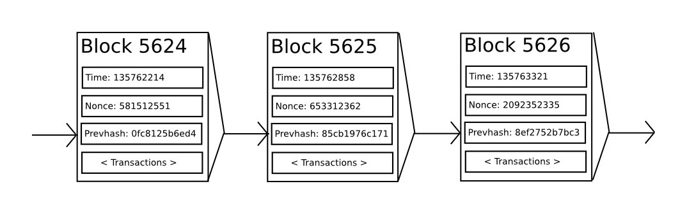

## History

The concept of decentralized digital currency, as well as alternative applications
like property registries, has been around for decades. The anonymous e-cash protocols
of the 1980s and the 1990s, mostly reliant on a cryptographic primitive known as Chaumian blinding,
provided a currency with a high degree of privacy, but the protocols largely failed to gain traction
because of their reliance on a centralized intermediary.
In 1998, Wei Dai's [b-money](http://www.weidai.com/bmoney.txt) became the first proposal
to introduce the idea of creating money through solving computational puzzles
as well as decentralized consensus, but the proposal was scant on details as to
how decentralized consensus could actually be implemented.
In 2005, Hal Finney introduced a concept of [reusable proofs of work](http://nakamotoinstitute.org/finney/rpow/),
a system which uses ideas from b-money together with Adam Back's computationally difficult Hashcash puzzles
to create a concept for a cryptocurrency, but once again fell short of the ideal
by relying on trusted computing as a backend.
In 2009, a decentralized currency was for the first time implemented
in practice by Satoshi Nakamoto, combining established primitives
for managing ownership through public key cryptography with
a consensus algorithm for keeping track of who owns coins, known as "proof of work".

The mechanism behind proof of work was a breakthrough in the space because
it simultaneously solved two problems. First, it provided a simple and
moderately effective consensus algorithm, allowing nodes in the network to collectively agree on a set of canonical updates to the state of the Bitcoin ledger. Second, it provided a mechanism for allowing free entry into the consensus process, solving the political problem of deciding who gets to influence the consensus, while simultaneously preventing sybil attacks. It does this by substituting a formal barrier to participation, such as the requirement to be registered as a unique entity on a particular list, with an economic barrier - the weight of a single node in the consensus voting process is directly proportional to the computing power that the node brings. Since then, an alternative approach has been proposed called _proof of stake_, calculating the weight of a node as being proportional to its currency holdings and not computational resources; the discussion of the relative merits of the two approaches is beyond the scope of this paper but it should be noted that both approaches can be used to serve as the backbone of a cryptocurrency.

## Bitcoin As A State Transition System

From a technical standpoint, the ledger of a cryptocurrency such as Bitcoin can be thought of as a state transition system, where there is a "state" consisting of the ownership status of all existing bitcoins and a "state transition function" that takes a state and a transaction and outputs a new state which is the result. In a standard banking system, for example, the state is a balance sheet, a transaction is a request to move $X from A to B, and the state transition function reduces the value in A's account by $X and increases the value in B's account by $X. If A's account has less than $X in the first place, the state transition function returns an error. Hence, one can formally define:

    APPLY(S,TX) -> S' or ERROR

In the banking system defined above:

    APPLY({ Alice: $50, Bob: $50 },"send $20 from Alice to Bob") = { Alice: $30, Bob: $70 }

But:

    APPLY({ Alice: $50, Bob: $50 },"send $70 from Alice to Bob") = ERROR

The "state" in Bitcoin is the collection of all coins (technically, "unspent transaction outputs" or UTXO) that have been mined and not yet spent, with each UTXO having a denomination and an owner (defined by a 20-byte address which is essentially a cryptographic public key [^1].
A transaction contains one or more inputs, with each input containing a reference to an existing UTXO and a cryptographic signature produced by the private key associated with the owner's address, and one or more outputs, with each output containing a new UTXO to be added to the state.

The state transition function `APPLY(S,TX) -> S'` can be defined roughly as follows:

1. For each input in `TX`:
   - If the referenced UTXO is not in `S`, return an error.
   - If the provided signature does not match the owner of the UTXO, return an error.
2. If the sum of the denominations of all input UTXO is less than the sum of the denominations of all output UTXO, return an error.
3. Return `S'` with all input UTXO removed and all output UTXO added.

The first half of the first step prevents transaction senders from spending coins that do not exist, the second half of the first step prevents transaction senders from spending other people's coins, and the second step enforces conservation of value. In order to use this for payment, the protocol is as follows. Suppose Alice wants to send 11.7 BTC to Bob. First, Alice will look for a set of available UTXO that she owns that totals up to at least 11.7 BTC. Realistically, Alice will not be able to get exactly 11.7 BTC; say that the smallest she can get is 6+4+2=12. She then creates a transaction with those three inputs and two outputs. The first output will be 11.7 BTC with Bob's address as its owner, and the second output will be the remaining 0.3 BTC "change", with the owner being Alice herself.

## Mining

If we had access to a trustworthy centralized service, this system would be trivial to implement; it could simply be coded exactly as described, using a centralized server's hard drive to keep track of the state. However, with Bitcoin we are trying to build a decentralized currency system, so we will need to combine the state transaction system with a consensus system in order to ensure that everyone agrees on the order of transactions. Bitcoin's decentralized consensus process requires nodes in the network to continuously attempt to produce packages of transactions called "blocks". The network is intended to produce roughly one block every ten minutes, with each block containing a timestamp, a nonce, a reference to (ie. hash of) the previous block and a list of all of the transactions that have taken place since the previous block. Over time, this creates a persistent, ever-growing, "blockchain" that constantly updates to represent the latest state of the Bitcoin ledger.

The algorithm for checking if a block is valid, expressed in this paradigm, is as follows:

1. Check if the previous block referenced by the block exists and is valid.
2. Check that the timestamp of the block is greater than that of the previous block [^2] and less than 2 hours into the future
3. Check that the proof of work on the block is valid.
4. Let `S[0]` be the state at the end of the previous block.
5. Suppose `TX` is the block's transaction list with `n` transactions. For all `i` in `0...n-1`, set `S[i+1] = APPLY(S[i],TX[i])` If any application returns an error, exit and return false.
6. Return true, and register `S[n]` as the state at the end of this block.

Essentially, each transaction in the block must provide a valid state transition from what was the canonical state before the transaction was executed to some new state. Note that the state is not encoded in the block in any way; it is purely an abstraction to be remembered by the validating node and can only be (securely) computed for any block by starting from the genesis state and sequentially applying every transaction in every block. Additionally, note that the order in which the miner includes transactions into the block matters; if there are two transactions A and B in a block such that B spends a UTXO created by A, then the block will be valid if A comes before B but not otherwise.

The one validity condition present in the above list that is not found in other systems is the requirement for "proof of work". The precise condition is that the double-SHA256 hash of every block, treated as a 256-bit number, must be less than a dynamically adjusted target, which as of the time of this writing is approximately 2187. The purpose of this is to make block creation computationally "hard", thereby preventing sybil attackers from remaking the entire blockchain in their favor. Because SHA256 is designed to be a completely unpredictable pseudorandom function, the only way to create a valid block is simply trial and error, repeatedly incrementing the nonce and seeing if the new hash matches.

At the current target of ~2187, the network must make an average of ~269 tries before a valid block is found; in general, the target is recalibrated by the network every 2016 blocks so that on average a new block is produced by some node in the network every ten minutes. In order to compensate miners for this computational work, the miner of every block is entitled to include a transaction giving themselves 12.5 BTC out of nowhere. Additionally, if any transaction has a higher total denomination in its inputs than in its outputs, the difference also goes to the miner as a "transaction fee". Incidentally, this is also the only mechanism by which BTC are issued; the genesis state contained no coins at all.

In order to better understand the purpose of mining, let us examine what happens in the event of a malicious attacker. Since Bitcoin's underlying cryptography is known to be secure, the attacker will target the one part of the Bitcoin system that is not protected by cryptography directly: the order of transactions. The attacker's strategy is simple:

1. Send 100 BTC to a merchant in exchange for some product (preferably a rapid-delivery digital good)
2. Wait for the delivery of the product
3. Produce another transaction sending the same 100 BTC to himself
4. Try to convince the network that his transaction to himself was the one that came first.

Once step (1) has taken place, after a few minutes some miner will include the transaction in a block, say block number 270. After about one hour, five more blocks will have been added to the chain after that block, with each of those blocks indirectly pointing to the transaction and thus "confirming" it. At this point, the merchant will accept the payment as finalized and deliver the product; since we are assuming this is a digital good, delivery is instant. Now, the attacker creates another transaction sending the 100 BTC to himself. If the attacker simply releases it into the wild, the transaction will not be processed; miners will attempt to run `APPLY(S,TX)` and notice that `TX` consumes a UTXO which is no longer in the state. So instead, the attacker creates a "fork" of the blockchain, starting by mining another version of block 270 pointing to the same block 269 as a parent but with the new transaction in place of the old one. Because the block data is different, this requires redoing the proof of work. Furthermore, the attacker's new version of block 270 has a different hash, so the original blocks 271 to 275 do not "point" to it; thus, the original chain and the attacker's new chain are completely separate. The rule is that in a fork the longest blockchain is taken to be the truth, and so legitimate miners will work on the 275 chain while the attacker alone is working on the 270 chain. In order for the attacker to make his blockchain the longest, he would need to have more computational power than the rest of the network combined in order to catch up (hence, "51% attack").

## Merkle Trees

_Left: it suffices to present only a small number of nodes in a Merkle tree to give a proof of the validity of a branch._

_Right: any attempt to change any part of the Merkle tree will eventually lead to an inconsistency somewhere up the chain._

An important scalability feature of Bitcoin is that the block is stored in a multi-level data structure. The "hash" of a block is actually only the hash of the block header, a roughly 200-byte piece of data that contains the timestamp, nonce, previous block hash and the root hash of a data structure called the Merkle tree storing all transactions in the block. A Merkle tree is a type of binary tree, composed of a set of nodes with a large number of leaf nodes at the bottom of the tree containing the underlying data, a set of intermediate nodes where each node is the hash of its two children, and finally a single root node, also formed from the hash of its two children, representing the "top" of the tree. The purpose of the Merkle tree is to allow the data in a block to be delivered piecemeal: a node can download only the header of a block from one source, the small part of the tree relevant to them from another source, and still be assured that all of the data is correct. The reason why this works is that hashes propagate upward: if a malicious user attempts to swap in a fake transaction into the bottom of a Merkle tree, this change will cause a change in the node above, and then a change in the node above that, finally changing the root of the tree and therefore the hash of the block, causing the protocol to register it as a completely different block (almost certainly with an invalid proof of work).

The Merkle tree protocol is arguably essential to long-term sustainability. A "full node" in the Bitcoin network, one that stores and processes the entirety of every block, takes up about 15 GB of disk space in the Bitcoin network as of April 2014, and is growing by over a gigabyte per month. Currently, this is viable for some desktop computers and not phones, and later on in the future only businesses and hobbyists will be able to participate. A protocol known as "simplified payment verification" (SPV) allows for another class of nodes to exist, called "light nodes", which download the block headers, verify the proof of work on the block headers, and then download only the "branches" associated with transactions that are relevant to them. This allows light nodes to determine with a strong guarantee of security what the status of any Bitcoin transaction, and their current balance, is while downloading only a very small portion of the entire blockchain.

## Alternative Blockchain Applications

The idea of taking the underlying blockchain idea and applying it to other concepts also has a long history. In 1998, Nick Szabo came out with the concept of [secure property titles with owner authority](http://nakamotoinstitute.org/secure-property-titles/), a document describing how "new advances in replicated database technology" will allow for a blockchain-based system for storing a registry of who owns what land, creating an elaborate framework including concepts such as homesteading, adverse possession and Georgian land tax. However, there was unfortunately no effective replicated database system available at the time, and so the protocol was never implemented in practice. After 2009, however, once Bitcoin's decentralized consensus was developed a number of alternative applications rapidly began to emerge.

- **Namecoin** - created in 2010, [Namecoin](https://namecoin.org/) is best described as a decentralized name registration database. In decentralized protocols like Tor, Bitcoin and BitMessage, there needs to be some way of identifying accounts so that other people can interact with them, but in all existing solutions the only kind of identifier available is a pseudorandom hash like `1LW79wp5ZBqaHW1jL5TCiBCrhQYtHagUWy`. Ideally, one would like to be able to have an account with a name like "george". However, the problem is that if one person can create an account named "george" then someone else can use the same process to register "george" for themselves as well and impersonate them. The only solution is a first-to-file paradigm, where the first registerer succeeds and the second fails - a problem perfectly suited for the Bitcoin consensus protocol. Namecoin is the oldest, and most successful, implementation of a name registration system using such an idea.
- **Colored coins** - the purpose of [colored coins](https://docs.google.com/a/buterin.com/document/d/1AnkP_cVZTCMLIzw4DvsW6M8Q2JC0lIzrTLuoWu2z1BE/edit) is to serve as a protocol to allow people to create their own digital currencies - or, in the important trivial case of a currency with one unit, digital tokens, on the Bitcoin blockchain. In the colored coins protocol, one "issues" a new currency by publicly assigning a color to a specific Bitcoin UTXO, and the protocol recursively defines the color of other UTXO to be the same as the color of the inputs that the transaction creating them spent (some special rules apply in the case of mixed-color inputs). This allows users to maintain wallets containing only UTXO of a specific color and send them around much like regular bitcoins, backtracking through the blockchain to determine the color of any UTXO that they receive.
- **Metacoins** - the idea behind a metacoin is to have a protocol that lives on top of Bitcoin, using Bitcoin transactions to store metacoin transactions but having a different state transition function, `APPLY'`. Because the metacoin protocol cannot prevent invalid metacoin transactions from appearing in the Bitcoin blockchain, a rule is added that if `APPLY'(S,TX)` returns an error, the protocol defaults to `APPLY'(S,TX) = S`. This provides an easy mechanism for creating an arbitrary cryptocurrency protocol, potentially with advanced features that cannot be implemented inside of Bitcoin itself, but with a very low development cost since the complexities of mining and networking are already handled by the Bitcoin protocol. Metacoins have been used to implement some classes of financial contracts, name registration and decentralized exchange.

Thus, in general, there are two approaches toward building a consensus protocol: building an independent network, and building a protocol on top of Bitcoin. The former approach, while reasonably successful in the case of applications like Namecoin, is difficult to implement; each individual implementation needs to bootstrap an independent blockchain, as well as building and testing all of the necessary state transition and networking code. Additionally, we predict that the set of applications for decentralized consensus technology will follow a power law distribution where the vast majority of applications would be too small to warrant their own blockchain, and we note that there exist large classes of decentralized applications, particularly decentralized autonomous organizations, that need to interact with each other.

The Bitcoin-based approach, on the other hand, has the flaw that it does not inherit the simplified payment verification features of Bitcoin. SPV works for Bitcoin because it can use blockchain depth as a proxy for validity; at some point, once the ancestors of a transaction go far enough back, it is safe to say that they were legitimately part of the state. Blockchain-based meta-protocols, on the other hand, cannot force the blockchain not to include transactions that are not valid within the context of their own protocols. Hence, a fully secure SPV meta-protocol implementation would need to backward scan all the way to the beginning of the Bitcoin blockchain to determine whether or not certain transactions are valid. Currently, all "light" implementations of Bitcoin-based meta-protocols rely on a trusted server to provide the data, arguably a highly suboptimal result especially when one of the primary purposes of a cryptocurrency is to eliminate the need for trust.

## Scripting

Even without any extensions, the Bitcoin protocol actually does facilitate a weak version of a concept of "smart contracts". UTXO in Bitcoin can be owned not just by a public key, but also by a more complicated script expressed in a simple stack-based programming language. In this paradigm, a transaction spending that UTXO must provide data that satisfies the script. Indeed, even the basic public key ownership mechanism is implemented via a script: the script takes an elliptic curve signature as input, verifies it against the transaction and the address that owns the UTXO, and returns 1 if the verification is successful and 0 otherwise. Other, more complicated, scripts exist for various additional use cases. For example, one can construct a script that requires signatures from two out of a given three private keys to validate ("multisig"), a setup useful for corporate accounts, secure savings accounts and some merchant escrow situations. Scripts can also be used to pay bounties for solutions to computational problems, and one can even construct a script that says something like "this Bitcoin UTXO is yours if you can provide an SPV proof that you sent a Dogecoin transaction of this denomination to me", essentially allowing decentralized cross-cryptocurrency exchange.

However, the scripting language as implemented in Bitcoin has several important limitations:

- **Lack of Turing-completeness** - that is to say, while there is a large subset of computation that the Bitcoin scripting language supports, it does not nearly support everything. The main category that is missing is loops. This is done to avoid infinite loops during transaction verification; theoretically it is a surmountable obstacle for script programmers, since any loop can be simulated by simply repeating the underlying code many times with an if statement, but it does lead to scripts that are very space-inefficient. For example, implementing an alternative elliptic curve signature algorithm would likely require 256 repeated multiplication rounds all individually included in the code.
- **Value-blindness** - there is no way for a UTXO script to provide fine-grained control over the amount that can be withdrawn. For example, one powerful use case of an oracle contract would be a hedging contract, where A and B put in $1000 worth of BTC and after 30 days the script sends $1000 worth of BTC to A and the rest to B. This would require an oracle to determine the value of 1 BTC in USD, but even then it is a massive improvement in terms of trust and infrastructure requirement over the fully centralized solutions that are available now. However, because UTXO are all-or-nothing, the only way to achieve this is through the very inefficient hack of having many UTXO of varying denominations (eg. one UTXO of 2k for every k up to 30) and having O pick which UTXO to send to A and which to B.
- **Lack of state** - UTXO can either be spent or unspent; there is no opportunity for multi-stage contracts or scripts which keep any other internal state beyond that. This makes it hard to make multi-stage options contracts, decentralized exchange offers or two-stage cryptographic commitment protocols (necessary for secure computational bounties). It also means that UTXO can only be used to build simple, one-off contracts and not more complex "stateful" contracts such as decentralized organizations, and makes meta-protocols difficult to implement. Binary state combined with value-blindness also mean that another important application, withdrawal limits, is impossible.
- **Blockchain-blindness** - UTXO are blind to blockchain data such as the nonce, the timestamp and previous block hash. This severely limits applications in gambling, and several other categories, by depriving the scripting language of a potentially valuable source of randomness.

Thus, we see three approaches to building advanced applications on top of cryptocurrency: building a new blockchain, using scripting on top of Bitcoin, and building a meta-protocol on top of Bitcoin. Building a new blockchain allows for unlimited freedom in building a feature set, but at the cost of development time, bootstrapping effort and security. Using scripting is easy to implement and standardize, but is very limited in its capabilities, and meta-protocols, while easy, suffer from faults in scalability. With Ethereum, we intend to build an alternative framework that provides even larger gains in ease of development as well as even stronger light client properties, while at the same time allowing applications to share an economic environment and blockchain security.

