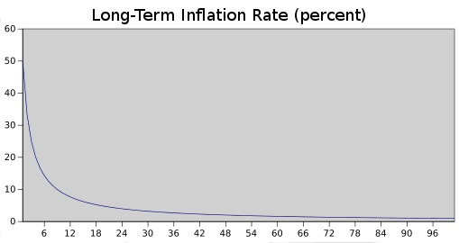

## Modified GHOST Implementation

The "Greedy Heaviest Observed Subtree" (GHOST) protocol is an innovation first introduced by Yonatan Sompolinsky and Aviv Zohar in [December 2013](https://eprint.iacr.org/2013/881.pdf). The motivation behind GHOST is that blockchains with fast confirmation times currently suffer from reduced security due to a high stale rate - because blocks take a certain time to propagate through the network, if miner A mines a block and then miner B happens to mine another block before miner A's block propagates to B, miner B's block will end up wasted and will not contribute to network security. Furthermore, there is a centralization issue: if miner A is a mining pool with 30% hashpower and B has 10% hashpower, A will have a risk of producing a stale block 70% of the time (since the other 30% of the time A produced the last block and so will get mining data immediately) whereas B will have a risk of producing a stale block 90% of the time. Thus, if the block interval is short enough for the stale rate to be high, A will be substantially more efficient simply by virtue of its size. With these two effects combined, blockchains which produce blocks quickly are very likely to lead to one mining pool having a large enough percentage of the network hashpower to have de facto control over the mining process.

As described by Sompolinsky and Zohar, GHOST solves the first issue of network security loss by including stale blocks in the calculation of which chain is the "longest"; that is to say, not just the parent and further ancestors of a block, but also the stale descendants of the block's ancestor (in Ethereum jargon, "uncles") are added to the calculation of which block has the largest total proof of work backing it. To solve the second issue of centralization bias, we go beyond the protocol described by Sompolinsky and Zohar, and also provide block rewards to stales: a stale block receives 87.5% of its base reward, and the nephew that includes the stale block receives the remaining 12.5%. Transaction fees, however, are not awarded to uncles.

Ethereum implements a simplified version of GHOST which only goes down seven levels. Specifically, it is defined as follows:

* A block must specify a parent, and it must specify 0 or more uncles
* An uncle included in block `B` must have the following properties:
  * It must be a direct child of the `k`-th generation ancestor of `B`, where `2 <= k <= 7`.
  * It cannot be an ancestor of `B`
  * An uncle must be a valid block header, but does not need to be a previously verified or even valid block
  * An uncle must be different from all uncles included in previous blocks and all other uncles included in the same block (non-double-inclusion)
* For every uncle `U` in block `B`, the miner of `B` gets an additional 3.125% added to its coinbase reward and the miner of U gets 93.75% of a standard coinbase reward.

This limited version of GHOST, with uncles includable only up to 7 generations, was used for two reasons. First, unlimited GHOST would include too many complications into the calculation of which uncles for a given block are valid. Second, unlimited GHOST with compensation as used in Ethereum removes the incentive for a miner to mine on the main chain and not the chain of a public attacker.

## Fees

Because every transaction published into the blockchain imposes on the network the cost of needing to download and verify it, there is a need for some regulatory mechanism, typically involving transaction fees, to prevent abuse. The default approach, used in Bitcoin, is to have purely voluntary fees, relying on miners to act as the gatekeepers and set dynamic minimums. This approach has been received very favorably in the Bitcoin community particularly because it is "market-based", allowing supply and demand between miners and transaction senders determine the price. The problem with this line of reasoning is, however, that transaction processing is not a market; although it is intuitively attractive to construe transaction processing as a service that the miner is offering to the sender, in reality every transaction that a miner includes will need to be processed by every node in the network, so the vast majority of the cost of transaction processing is borne by third parties and not the miner that is making the decision of whether or not to include it. Hence, tragedy-of-the-commons problems are very likely to occur.

However, as it turns out this flaw in the market-based mechanism, when given a particular inaccurate simplifying assumption, magically cancels itself out. The argument is as follows. Suppose that:

1. A transaction leads to `k` operations, offering the reward `kR` to any miner that includes it where `R` is set by the sender and `k` and `R` are (roughly) visible to the miner beforehand.
2. An operation has a processing cost of `C` to any node (ie. all nodes have equal efficiency)
3. There are `N` mining nodes, each with exactly equal processing power (ie. `1/N` of total)
4. No non-mining full nodes exist.

A miner would be willing to process a transaction if the expected reward is greater than the cost. Thus, the expected reward is `kR/N` since the miner has a `1/N` chance of processing the next block, and the processing cost for the miner is simply `kC`. Hence, miners will include transactions where `kR/N > kC`, or `R > NC`. Note that `R` is the per-operation fee provided by the sender, and is thus a lower bound on the benefit that the sender derives from the transaction, and `NC` is the cost to the entire network together of processing an operation. Hence, miners have the incentive to include only those transactions for which the total utilitarian benefit exceeds the cost.

However, there are several important deviations from those assumptions in reality:

1. The miner does pay a higher cost to process the transaction than the other verifying nodes, since the extra verification time delays block propagation and thus increases the chance the block will become a stale.
2. There do exist nonmining full nodes.
3. The mining power distribution may end up radically inegalitarian in practice.
4. Speculators, political enemies and crazies whose utility function includes causing harm to the network do exist, and they can cleverly set up contracts where their cost is much lower than the cost paid by other verifying nodes.

(1) provides a tendency for the miner to include fewer transactions, and (2) increases `NC`; hence, these two effects at least partially cancel each other out.[How?](https://github.com/ethereum/wiki/issues/447#issuecomment-316972260) (3) and (4) are the major issue; to solve them we simply institute a floating cap: no block can have more operations than `BLK_LIMIT_FACTOR` times the long-term exponential moving average. Specifically:

    blk.oplimit = floor((blk.parent.oplimit * (EMAFACTOR - 1) + floor(parent.opcount * BLK_LIMIT_FACTOR)) / EMA_FACTOR)

`BLK_LIMIT_FACTOR` and `EMA_FACTOR` are constants that will be set to 65536 and 1.5 for the time being, but will likely be changed after further analysis.

There is another factor disincentivizing large block sizes in Bitcoin: blocks that are large will take longer to propagate, and thus have a higher probability of becoming stales. In Ethereum, highly gas-consuming blocks can also take longer to propagate both because they are physically larger and because they take longer to process the transaction state transitions to validate. This delay disincentive is a significant consideration in Bitcoin, but less so in Ethereum because of the GHOST protocol; hence, relying on regulated block limits provides a more stable baseline.

## Computation And Turing-Completeness

An important note is that the Ethereum virtual machine is Turing-complete; this means that EVM code can encode any computation that can be conceivably carried out, including infinite loops. EVM code allows looping in two ways. First, there is a `JUMP` instruction that allows the program to jump back to a previous spot in the code, and a `JUMPI` instruction to do conditional jumping, allowing for statements like `while x < 27: x = x * 2`. Second, contracts can call other contracts, potentially allowing for looping through recursion. This naturally leads to a problem: can malicious users essentially shut miners and full nodes down by forcing them to enter into an infinite loop? The issue arises because of a problem in computer science known as the halting problem: there is no way to tell, in the general case, whether or not a given program will ever halt.

As described in the state transition section, our solution works by requiring a transaction to set a maximum number of computational steps that it is allowed to take, and if execution takes longer computation is reverted but fees are still paid. Messages work in the same way. To show the motivation behind our solution, consider the following examples:

* An attacker creates a contract which runs an infinite loop, and then sends a transaction activating that loop to the miner. The miner will process the transaction, running the infinite loop, and wait for it to run out of gas. Even though the execution runs out of gas and stops halfway through, the transaction is still valid and the miner still claims the fee from the attacker for each computational step.
* An attacker creates a very long infinite loop with the intent of forcing the miner to keep computing for such a long time that by the time computation finishes a few more blocks will have come out and it will not be possible for the miner to include the transaction to claim the fee. However, the attacker will be required to submit a value for `STARTGAS` limiting the number of computational steps that execution can take, so the miner will know ahead of time that the computation will take an excessively large number of steps.
* An attacker sees a contract with code of some form like `send(A,contract.storage[A]); contract.storage[A] = 0`, and sends a transaction with just enough gas to run the first step but not the second (ie. making a withdrawal but not letting the balance go down). The contract author does not need to worry about protecting against such attacks, because if execution stops halfway through the changes they get reverted.
* A financial contract works by taking the median of nine proprietary data feeds in order to minimize risk. An attacker takes over one of the data feeds, which is designed to be modifiable via the variable-address-call mechanism described in the section on DAOs, and converts it to run an infinite loop, thereby attempting to force any attempts to claim funds from the financial contract to run out of gas. However, the financial contract can set a gas limit on the message to prevent this problem.

The alternative to Turing-completeness is Turing-incompleteness, where `JUMP` and `JUMPI` do not exist and only one copy of each contract is allowed to exist in the call stack at any given time. With this system, the fee system described and the uncertainties around the effectiveness of our solution might not be necessary, as the cost of executing a contract would be bounded above by its size. Additionally, Turing-incompleteness is not even that big a limitation; out of all the contract examples we have conceived internally, so far only one required a loop, and even that loop could be removed by making 26 repetitions of a one-line piece of code. Given the serious implications of Turing-completeness, and the limited benefit, why not simply have a Turing-incomplete language? In reality, however, Turing-incompleteness is far from a neat solution to the problem. To see why, consider the following contracts:

    C0: call(C1); call(C1);
    C1: call(C2); call(C2);
    C2: call(C3); call(C3);
    ...
    C49: call(C50); call(C50);
    C50: (run one step of a program and record the change in storage)

Now, send a transaction to A. Thus, in 51 transactions, we have a contract that takes up 250 computational steps. Miners could try to detect such logic bombs ahead of time by maintaining a value alongside each contract specifying the maximum number of computational steps that it can take, and calculating this for contracts calling other contracts recursively, but that would require miners to forbid contracts that create other contracts (since the creation and execution of all 26 contracts above could easily be rolled into a single contract). Another problematic point is that the address field of a message is a variable, so in general it may not even be possible to tell which other contracts a given contract will call ahead of time. Hence, all in all, we have a surprising conclusion: Turing-completeness is surprisingly easy to manage, and the lack of Turing-completeness is equally surprisingly difficult to manage unless the exact same controls are in place - but in that case why not just let the protocol be Turing-complete?

## Currency And Issuance

The Ethereum network includes its own built-in currency, ether, which serves the dual purpose of providing a primary liquidity layer to allow for efficient exchange between various types of digital assets and, more importantly, of providing a mechanism for paying transaction fees. For convenience and to avoid future argument (see the current mBTC/uBTC/satoshi debate in Bitcoin), the denominations will be pre-labelled:

* 1: wei
* 1012: szabo
* 1015: finney
* 1018: ether

This should be taken as an expanded version of the concept of "dollars" and "cents" or "BTC" and "satoshi". In the near future, we expect "ether" to be used for ordinary transactions, "finney" for microtransactions and "szabo" and "wei" for technical discussions around fees and protocol implementation; the remaining denominations may become useful later and should not be included in clients at this point.

The issuance model will be as follows:

* Ether will be released in a currency sale at the price of 1000-2000 ether per BTC, a mechanism intended to fund the Ethereum organization and pay for development that has been used with success by other platforms such as Mastercoin and NXT. Earlier buyers will benefit from larger discounts. The BTC received from the sale will be used entirely to pay salaries and bounties to developers and invested into various for-profit and non-profit projects in the Ethereum and cryptocurrency ecosystem.
* 0.099x the total amount sold (60102216 ETH) will be allocated to the organization to compensate early contributors and pay ETH-denominated expenses before the genesis block.
* 0.099x the total amount sold will be maintained as a long-term reserve.
* 0.26x the total amount sold will be allocated to miners per year forever after that point.

| Group  | At launch | After 1 year | After 5 years
| ------------- | ------------- |-------------| ----------- |
| Currency units  | 1.198X | 1.458X  |  2.498X |
| Purchasers  | 83.5% | 68.6%  | 40.0% |
| Reserve spent pre-sale | 8.26% | 6.79% | 3.96% |
| Reserve used post-sale | 8.26% | 6.79% | 3.96% |
| Miners | 0% | 17.8% | 52.0% |

**Long-Term Supply Growth Rate (percent)**

_Despite the linear currency issuance, just like with Bitcoin over time the supply growth rate nevertheless tends to zero_

The two main choices in the above model are (1) the existence and size of an endowment pool, and (2) the existence of a permanently growing linear supply, as opposed to a capped supply as in Bitcoin. The justification of the endowment pool is as follows. If the endowment pool did not exist, and the linear issuance reduced to 0.217x to provide the same inflation rate, then the total quantity of ether would be 16.5% less and so each unit would be 19.8% more valuable. Hence, in the equilibrium 19.8% more ether would be purchased in the sale, so each unit would once again be exactly as valuable as before. The organization would also then have 1.198x as much BTC, which can be considered to be split into two slices: the original BTC, and the additional 0.198x. Hence, this situation is _exactly equivalent_ to the endowment, but with one important difference: the organization holds purely BTC, and so is not incentivized to support the value of the ether unit.

The permanent linear supply growth model reduces the risk of what some see as excessive wealth concentration in Bitcoin, and gives individuals living in present and future eras a fair chance to acquire currency units, while at the same time retaining a strong incentive to obtain and hold ether because the "supply growth rate" as a percentage still tends to zero over time. We also theorize that because coins are always lost over time due to carelessness, death, etc, and coin loss can be modeled as a percentage of the total supply per year, that the total currency supply in circulation will in fact eventually stabilize at a value equal to the annual issuance divided by the loss rate (eg. at a loss rate of 1%, once the supply reaches 26X then 0.26X will be mined and 0.26X lost every year, creating an equilibrium).

Note that in the future, it is likely that Ethereum will switch to a proof-of-stake model for security, reducing the issuance requirement to somewhere between zero and 0.05X per year. In the event that the Ethereum organization loses funding or for any other reason disappears, we leave open a "social contract": anyone has the right to create a future candidate version of Ethereum, with the only condition being that the quantity of ether must be at most equal to `60102216 * (1.198 + 0.26 * n)` where `n` is the number of years after the genesis block. Creators are free to crowd-sell or otherwise assign some or all of the difference between the PoS-driven supply expansion and the maximum allowable supply expansion to pay for development. Candidate upgrades that do not comply with the social contract may justifiably be forked into compliant versions.

## Mining Centralization

The Bitcoin mining algorithm works by having miners compute SHA256 on slightly modified versions of the block header millions of times over and over again, until eventually one node comes up with a version whose hash is less than the target (currently around 2192). However, this mining algorithm is vulnerable to two forms of centralization. First, the mining ecosystem has come to be dominated by ASICs (application-specific integrated circuits), computer chips designed for, and therefore thousands of times more efficient at, the specific task of Bitcoin mining. This means that Bitcoin mining is no longer a highly decentralized and egalitarian pursuit, requiring millions of dollars of capital to effectively participate in. Second, most Bitcoin miners do not actually perform block validation locally; instead, they rely on a centralized mining pool to provide the block headers. This problem is arguably worse: as of the time of this writing, the top three mining pools indirectly control roughly 50% of processing power in the Bitcoin network, although this is mitigated by the fact that miners can switch to other mining pools if a pool or coalition attempts a 51% attack.

The current intent at Ethereum is to use a mining algorithm where miners are required to fetch random data from the state, compute some randomly selected transactions from the last N blocks in the blockchain, and return the hash of the result. This has two important benefits. First, Ethereum contracts can include any kind of computation, so an Ethereum ASIC would essentially be an ASIC for general computation - ie. a better CPU. Second, mining requires access to the entire blockchain, forcing miners to store the entire blockchain and at least be capable of verifying every transaction. This removes the need for centralized mining pools; although mining pools can still serve the legitimate role of evening out the randomness of reward distribution, this function can be served equally well by peer-to-peer pools with no central control.

This model is untested, and there may be difficulties along the way in avoiding certain clever optimizations when using contract execution as a mining algorithm. However, one notably interesting feature of this algorithm is that it allows anyone to "poison the well", by introducing a large number of contracts into the blockchain specifically designed to stymie certain ASICs. The economic incentives exist for ASIC manufacturers to use such a trick to attack each other. Thus, the solution that we are developing is ultimately an adaptive economic human solution rather than purely a technical one.

## Scalability

One common concern about Ethereum is the issue of scalability. Like Bitcoin, Ethereum suffers from the flaw that every transaction needs to be processed by every node in the network. With Bitcoin, the size of the current blockchain rests at about 15 GB, growing by about 1 MB per hour. If the Bitcoin network were to process Visa's 2000 transactions per second, it would grow by 1 MB per three seconds (1 GB per hour, 8 TB per year). Ethereum is likely to suffer a similar growth pattern, worsened by the fact that there will be many applications on top of the Ethereum blockchain instead of just a currency as is the case with Bitcoin, but ameliorated by the fact that Ethereum full nodes need to store just the state instead of the entire blockchain history.

The problem with such a large blockchain size is centralization risk. If the blockchain size increases to, say, 100 TB, then the likely scenario would be that only a very small number of large businesses would run full nodes, with all regular users using light SPV nodes. In such a situation, there arises the potential concern that the full nodes could band together and all agree to cheat in some profitable fashion (eg. change the block reward, give themselves BTC). Light nodes would have no way of detecting this immediately. Of course, at least one honest full node would likely exist, and after a few hours information about the fraud would trickle out through channels like Reddit, but at that point it would be too late: it would be up to the ordinary users to organize an effort to blacklist the given blocks, a massive and likely infeasible coordination problem on a similar scale as that of pulling off a successful 51% attack. In the case of Bitcoin, this is currently a problem, but there exists a blockchain modification [suggested by Peter Todd](https://web.archive.org/web/20140623061815/http://sourceforge.net/p/bitcoin/mailman/message/31709140/) which will alleviate this issue.

In the near term, Ethereum will use two additional strategies to cope with this problem. First, because of the blockchain-based mining algorithms, at least every miner will be forced to be a full node, creating a lower bound on the number of full nodes. Second and more importantly, however, we will include an intermediate state tree root in the blockchain after processing each transaction. Even if block validation is centralized, as long as one honest verifying node exists, the centralization problem can be circumvented via a verification protocol. If a miner publishes an invalid block, that block must either be badly formatted, or the state `S[n]` is incorrect. Since `S[0]` is known to be correct, there must be some first state `S[i]` that is incorrect where `S[i-1]` is correct. The verifying node would provide the index `i`, along with a "proof of invalidity" consisting of the subset of Patricia tree nodes needing to process `APPLY(S[i-1],TX[i]) -> S[i]`. Nodes would be able to use those nodes to run that part of the computation, and see that the `S[i]` generated does not match the `S[i]` provided.

Another, more sophisticated, attack would involve the malicious miners publishing incomplete blocks, so the full information does not even exist to determine whether or not blocks are valid. The solution to this is a challenge-response protocol: verification nodes issue "challenges" in the form of target transaction indices, and upon receiving a node a light node treats the block as untrusted until another node, whether the miner or another verifier, provides a subset of Patricia nodes as a proof of validity.

